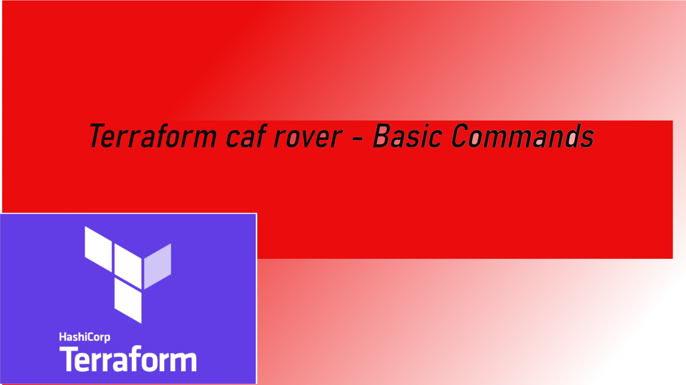

# terraform-caf-rover: Basic Command

Basic commands

1.  terraform init
2.  terraform validate
3.  terraform plan
4.  terraform apply

# Pre condition

1.  Git clone command to clone the repo.
1.  Docker up and running
1.  Run the container
1.  Type command `az login`

# Execute command to zsh shell

Now you are inside the container you may use `t` as alias of the `terraform`

1.  t init
1.  t validate
1.  t plan
1.  t apply

# You Tube link

