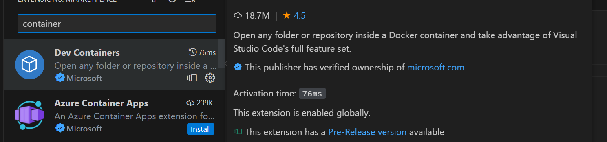
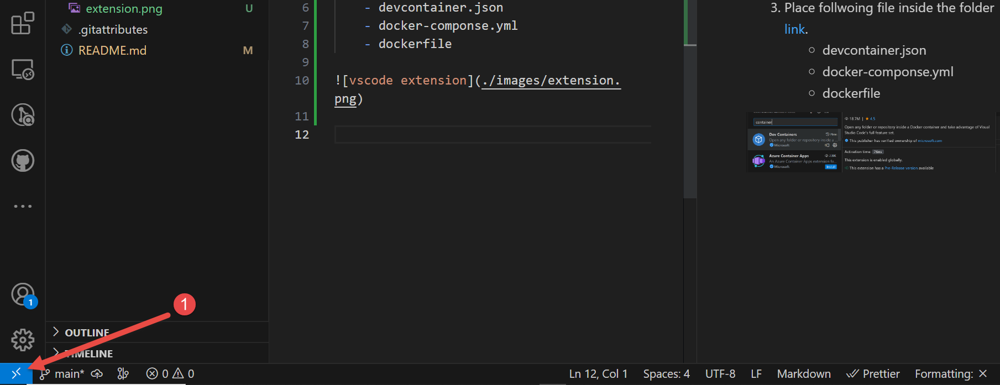
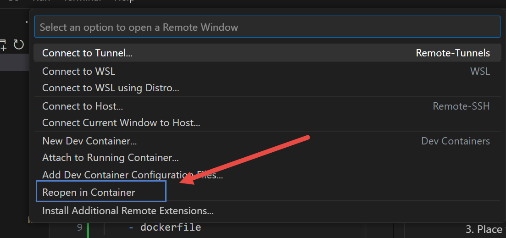
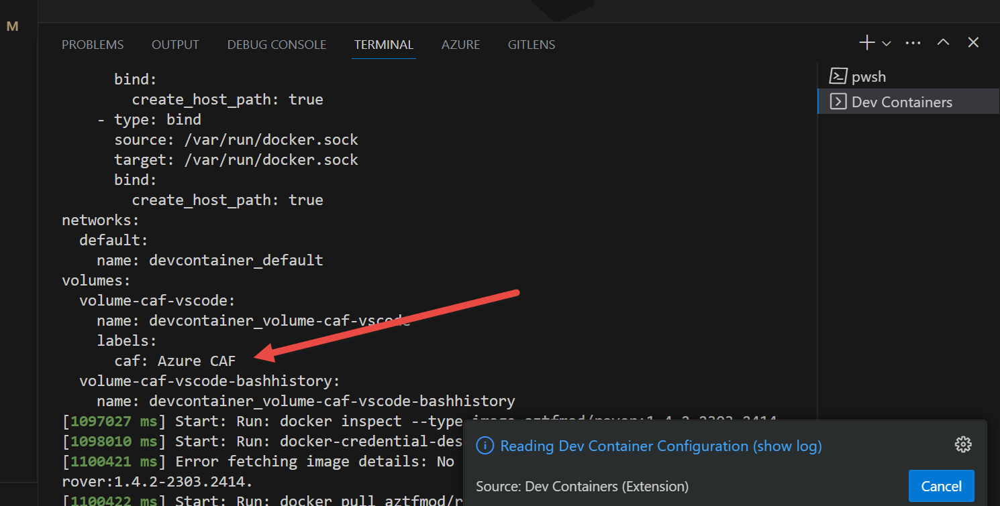
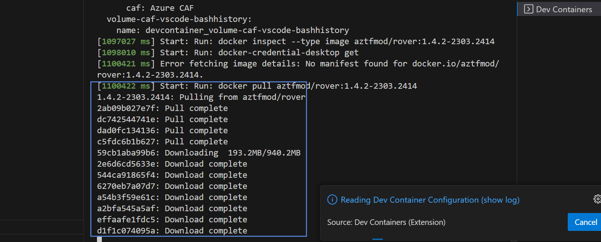
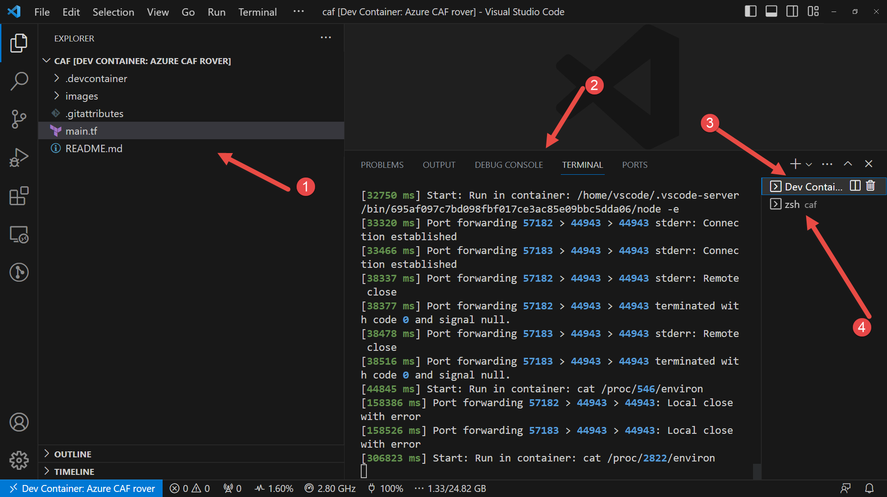
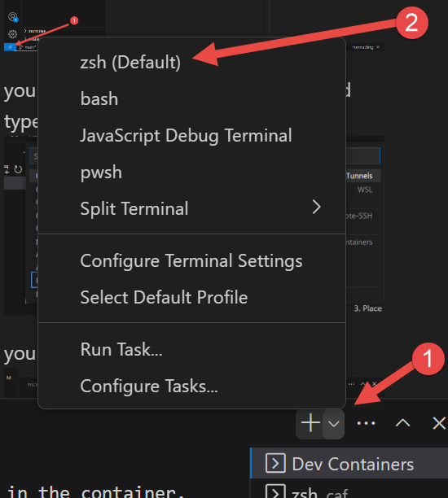
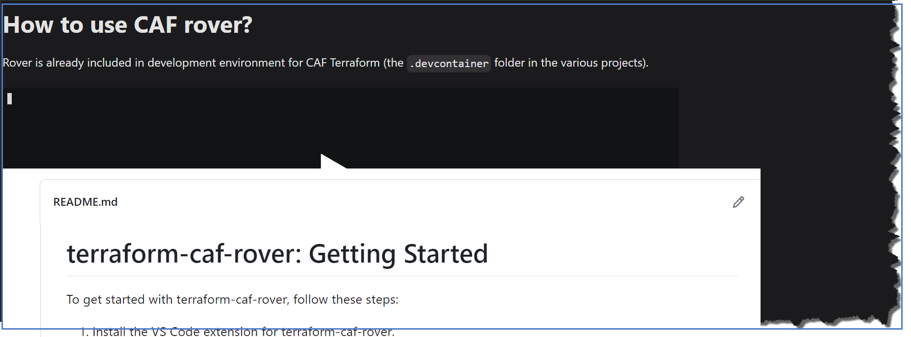

# terraform-caf-rover: Getting Started
 To get started with terraform-caf-rover, follow these steps:
 1. Install the VS Code extension for terraform-caf-rover.
 
 1. Create a .devcontainer folder.
 1. Place the following files inside the .devcontainer folder. You can find these files [here](https://github.com/aztfmod/rover/tree/main/.devcontainer).
    - devcontainer.json
    - docker-compose.yml
    - dockerfile

1. Click the icon located at the bottom-left corner of the VS Code screen.

1. Alternatively, you can use the shortcut Ctrl+P and type reopen in container followed by pressing the Enter key. 
1. You will see the progress as the environment is set up.

1. The terraform-caf-rover image will be downloaded from Docker Hub.
 
1. Once the download is complete, VS Code will open in a new window with the container started.

1. Open the default terminal, which should be set to Zsh.

`Please note that these steps assume you have already installed Docker and have basic familiarity with VS Code.`

## Youtube Link

